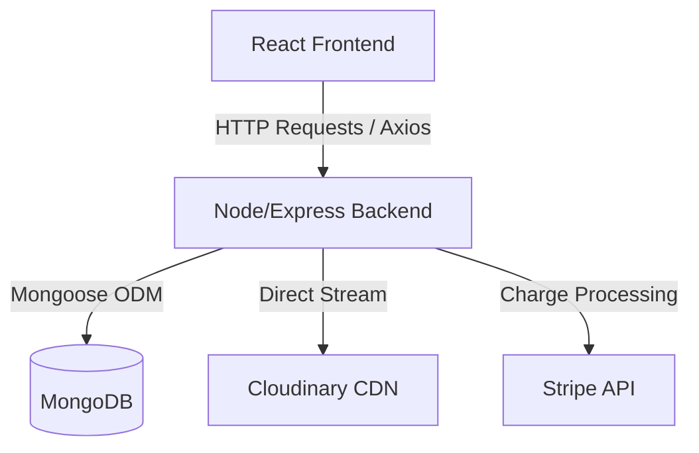

# Community Dabba Manager

Welcome to the **Community Dabba Manager**, a modern, full-stack, role-based tiffin and meal subscription management system. It enables customers to order meals, purchase weekly or monthly subscriptions, and track deliveries, while giving kitchen staff, delivery partners, and administrators full control over their workflows.

---

## 🏗️ System Architecture & Project Flow

The application is split into a **React (Vite) Frontend** and a **Node.js (Express) Backend**, utilizing a **MongoDB** database for storage.



### 👥 User Roles & Their Workflows

1. **Customers (Subscribers & Diners)**
   - Register, log in, and view the active menu.
   - Subscribe to tiffin plans (weekly, monthly) or purchase individual meals.
   - Complete secure checkout using Stripe payments.
   - Write feedback & ratings for meals.
   - Receive notification updates when orders are dispatched or delivered.

2. **Kitchen Staff (Creators & Cooks)**
   - Access the kitchen dashboard.
   - View, create, update, and delete menu items.
   - Upload dish photos using Cloudinary integration (directly from a file upload form).
   - Toggle menu item availability in real-time.

3. **Delivery Partners (Couriers)**
   - Access the delivery dashboard.
   - View pending, dispatched, and completed delivery tasks.
   - Update order status (e.g., mark as "Delivered" on the spot).

4. **Admins (Managers & Owners)**
   - Access the administrative dashboard.
   - Monitor real-time analytics (revenue, order counts, customer subscriptions).
   - Visualize sales trends & plan distributions using interactive charts.
   - Oversee users, feedback logs, subscriptions, and financial logs.

---

## 🛠️ Tech Stack Used

### Backend
- **Node.js**: Javascript runtime.
- **Express.js**: REST API server framework.
- **MongoDB & Mongoose**: Database & Object Document Mapper.
- **Cloudinary SDK**: Cloud storage for meal images.
- **Multer**: Memory buffer processing for file uploads.
- **Stripe SDK**: Payment processing.
- **JWT & bcryptjs**: Secure password hashing and token-based authentication.

### Frontend
- **React.js & Vite**: Core UI library and build tool.
- **Tailwind CSS**: Modern CSS utility classes for responsive layouts.
- **React Router DOM (v7)**: Navigation and route protection.
- **Context API (`AuthContext`)**: Handles persistent login state.
- **Axios**: HTTP requests configuration.
- **Recharts**: Responsive charting library for admin analytics.
- **Lucide React**: Clean vector icons.

---

## 🚀 Getting Started

To run the complete application locally, follow these steps:

### 1. Clone the Repository
```bash
git clone https://github.com/vamshigoud130/community_dabba.git
cd Community_Dabba_manager
```

### 2. Set Up the Backend
1. Navigate to the backend directory:
   ```bash
   cd backend
   ```
2. Install dependencies:
   ```bash
   npm install
   ```
3. Create a `.env` file:
   ```env
   PORT=5000
   MONGO_URI=your_mongodb_connection_uri
   JWT_SECRET=your_jwt_secret_key
   STRIPE_SECRET_KEY=your_stripe_secret_key
   CLOUDINARY_CLOUD_NAME=your_cloudinary_cloud_name
   CLOUDINARY_API_KEY=your_cloudinary_api_key
   CLOUDINARY_API_SECRET=your_cloudinary_api_secret
   ```
4. Optional: Seed the database with sample menu items and users:
   ```bash
   node seed.js
   ```
5. Run the server:
   ```bash
   npm start
   ```

### 3. Set Up the Frontend
1. Open a new terminal and navigate to the frontend directory:
   ```bash
   cd frontend
   ```
2. Install dependencies:
   ```bash
   npm install
   ```
3. Check the base URL configuration in `frontend/src/context/AuthContext.jsx` to make sure it matches your backend host (`http://localhost:5000/api`).
4. Run the frontend development server:
   ```bash
   npm run dev
   ```
5. Open your browser and navigate to the local host address shown in your terminal (usually `http://localhost:5173`).
